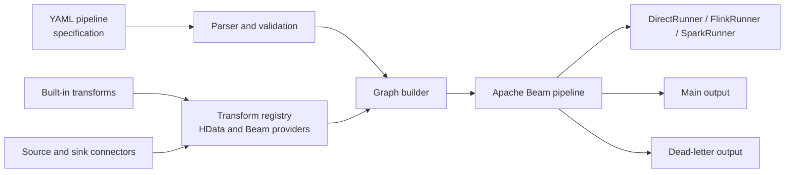

[](https://github.com/stuxuhai/HData/actions/workflows/ci.yml)
[](LICENSE)
[](https://openjdk.org/)
[](https://maven.apache.org/)

## HData

A data synchronization / ETL tool built on [Apache Beam](https://beam.apache.org/), written in Kotlin.
A job is described by a single pipeline file whose format aligns with the
[Beam YAML](https://beam.apache.org/documentation/sdks/yaml/) specification.

> See [README.zh-CN.md](README.zh-CN.md) for the Chinese documentation.

### Architecture



The [architecture notes](docs/ARCHITECTURE.md) describe the parsing, provider, graph and error-handling layers in detail.

### Features

- **YAML-defined jobs**: sources / transforms / sinks are all declared in one pipeline file — no code needed for common syncs.
- **Beam YAML compatible**: structure, variable substitution and `${VAR}` placeholders follow the Beam YAML spec, so pipelines migrate smoothly.
- **Rich connectors**: JDBC, Kafka, Pulsar, Hive, Redis, Neo4j, Iceberg, Debezium (CDC), MongoDB, HBase, FTP, Filesystem,
  Elasticsearch 6/8, RabbitMQ, ClickHouse, Cassandra, Amazon SQS, Prometheus, DynamoDB.
- **Dead letter**: bad records are routed to a downstream error collection instead of failing the job, and each dead-letter record keeps the original row's timestamp and window so it is replayable.
- **Multiple runners**: the same pipeline runs on DirectRunner / FlinkRunner / SparkRunner.
- **Push-down aggregation**: some connectors push `sum` / `avg` / `count` aggregations down to the source natively.
- **DAG construction**: supports chain / composite, branching & merging, nesting, topological sort and window propagation.

### Supported connectors

| Connector | Read | Write | Test coverage |
|---|:---:|:---:|---|
| JDBC | ✅ | ✅ | End-to-end (H2 in-memory + Testcontainers) |
| Kafka | ✅ | ✅ | End-to-end (MockConsumer, real SDF) + Testcontainers |
| Pulsar | ✅ | ✅ | Configuration/serialization tests + Testcontainers (real broker) |
| Hive | ✅ | ✅ | End-to-end (local dir + in-process metastore) + Testcontainers (real metastore Thrift service) |
| Redis | ✅ | ✅ | End-to-end (embedded-redis + Testcontainers) |
| Iceberg | ✅ | ✅ | End-to-end (local HadoopCatalog) + Testcontainers (S3-compatible warehouse) |
| Debezium | ✅ (CDC) | — | End-to-end (embedded engine) + Testcontainers (real MySQL binlog) |
| FTP | ✅ | ✅ | End-to-end (in-process FtpServer); a real-server container was evaluated and deferred, see [docs/CONNECTOR_ROADMAP.md](docs/CONNECTOR_ROADMAP.md) |
| Filesystem | ✅ | ✅ | End-to-end (local temp dir) + Testcontainers (MinIO) |
| Neo4j | ✅ | ✅ | Logic layer + Testcontainers |
| MongoDB | ✅ | ✅ | Logic layer + Testcontainers |
| HBase | ✅ | ✅ | Logic layer; a container test was evaluated and deferred, see [docs/CONNECTOR_ROADMAP.md](docs/CONNECTOR_ROADMAP.md) |
| Elasticsearch 6 | ✅ | ✅ | Logic layer + Testcontainers |
| Elasticsearch 8 | ✅ | ✅ | Logic layer + Testcontainers |
| RabbitMQ | ✅ | ✅ | Config validation + Testcontainers (real broker) |
| ClickHouse | ✅ | ✅ | Config validation + Testcontainers (real server) |
| Cassandra | ✅ | ✅ | Config validation + type-mapping logic + Testcontainers (real cluster) |
| Amazon SQS | ✅ | ✅ | Config validation + Testcontainers (real queue) |
| Prometheus | ✅ (read-only) | — | Config validation + parser logic + Testcontainers (real server) |
| DynamoDB | ✅ | ✅ | Config validation + type-mapping logic + Testcontainers (amazon/dynamodb-local) |

The `Read*` / `Write*` configuration parameters (types, defaults, constraints and mutual exclusions)
for every connector are documented in [docs/connectors.md](docs/connectors.md).

Supplemental service tests use the `integration-tests` Maven profile and classes ending in `IT`.
They run against disposable Testcontainers services; the regular `mvn test` suite remains self-contained.

### Quick start

```bash
mvn -q package

java -cp 'hdata-core/target/classes:hdata-jdbc/target/classes:<deps>' \
  me.jayer.hdata.core.HData --pipeline=examples/jdbc-to-jdbc.yaml
```

Common flags:

| Flag | Description |
|---|---|
| `--pipeline=<path>` | pipeline file (`.yaml` / `.yml`) |
| `--dryRun` | build the DAG and print it only, do not submit |
| `--runner=DirectRunner` | any Beam `PipelineOptions` can be passed on the command line |
| `--waitUntilFinish=false` | do not block after submit, useful for streaming jobs |

By default only DirectRunner is on the classpath:

| profile | runner dependency | Description |
|---|---|---|
| none | `beam-runners-direct-java` | default, `--runner=DirectRunner` |
| `-Pflink-runner` | `beam-runners-flink-2.2` | `--runner=FlinkRunner` |
| `-Pspark-runner` | `beam-runners-spark-4` | `--runner=SparkRunner`, Spark itself is provided by spark-submit |
| `-Pspark-local` | Spark 4 itself | layered on `-Pspark-runner`, only needed when running locally via `java -cp` |

> The Hadoop version pulled in by Spark is raised to **3.5.0** in the root pom. Spark 4.0.2's bundled
> Hadoop 3.4.1 still calls `Subject.getSubject(...)` in `UserGroupInformation`. Hadoop 3.5.0 uses
> `Subject.current()` instead. Downgrading Hadoop would break the Spark runner.

Packaging a deployable classpath and submitting to a real Flink/Spark cluster, secrets injection,
logging, and metrics are covered in [docs/DEPLOYMENT.md](docs/DEPLOYMENT.md).

### Build from source

Requirements:

- **JDK 17** (target bytecode Java 17)
- **Maven 3.9+** (this project ships no wrapper)

```bash
# first build needs network access to pull dependencies from Maven Central
mvn -q package

# run the full test suite (~1900 tests, no external services required)
mvn -q test
```

The program entry point is `me.jayer.hdata.core.HData`; see "Quick start" above for how to run it.

### The pipeline file

A linear job uses `chain`, where the input is implicitly provided by the previous node:

```yaml
pipeline:
  type: chain
  source:
    type: ReadFromJdbc
    config:
      url: "jdbc:mysql://127.0.0.1:3306/demo?useSSL=false"
      user: root
      password: "${MYSQL_PASSWORD}"
      tables: ["t_order"]
      partition_column: id
      partition_num: 8
  transforms:
    - type: MapToFields
      config:
        fields:
          order_id: id
          amount: total_amount
  sink:
    type: WriteToJdbc
    config:
      url: "jdbc:mysql://127.0.0.1:3306/dw?useSSL=false"
      user: root
      password: "${MYSQL_PASSWORD}"
      table: dws_order

options:
  runner: DirectRunner
```

For branching or merging use `composite` (the default when `type` is omitted); nodes reference each
other via `input`, and declaration order does not affect graph construction:

```yaml
pipeline:
  transforms:
    - type: Flatten
      name: AllOrders
      input: [ReadHot, ReadArchived]
    - type: ReadFromJdbc
      name: ReadHot
      config: { ... }
    - type: ReadFromJdbc
      name: ReadArchived
      config: { ... }
```

More examples in `examples/`:

- `jdbc-to-jdbc.yaml` — single-table sync
- `dead-letter.yaml` — dead letter: bad data lands in a separate table instead of failing the job
- `branching.yaml` — multi-source read, merge, branch, nested chain

`${VAR}` / `${VAR:-default}` in config are substituted before parsing, resolved from system properties
then environment variables, so passwords stay out of the config file.

### Built-in transforms

| type | Description |
|---|---|
| `Create` | build data from literals, schema auto-inferred |
| `MapToFields` | field select / rename / drop (`append` + `drop`) |
| `Flatten` | merge multiple inputs with the same schema |
| `LogForTesting` | print each record and pass it through |
| `StripErrorMetadata` | turn a dead-letter record back into the original record |
| `AssertEqual` | assert input equals a given set, used to test pipeline files |

Connectors (`hdata-jdbc`): `ReadFromJdbc` / `WriteToJdbc`.

The connector selection and implementation order are documented in [docs/CONNECTOR_ROADMAP.md](docs/CONNECTOR_ROADMAP.md).

A Beam-native `SchemaTransformProvider` on the classpath can also be used directly by its URN as `type`,
e.g. `beam:schematransform:org.apache.beam:jdbc_read:v1`.

### Dead letter

Declare `error_handling.output` in the sink's config; the error stream is then exposed as
`<node>.<output>` and **must be consumed by a downstream node**, otherwise graph construction fails:

```yaml
    - type: WriteToJdbc
      name: WriteOrders
      config:
        table: dws_order
        error_handling:
          output: rejected
  extra_transforms:
    - type: StripErrorMetadata
      name: Recovered
      input: WriteOrders.rejected
```

### Connector configuration reference

The `Read*` / `Write*` configuration parameters (types, defaults, constraints and mutual exclusions)
for all connectors — JDBC / Kafka / Pulsar / Hive / Redis / Neo4j / Iceberg / Debezium / MongoDB / HBase / FTP /
Filesystem / Elasticsearch 6/8 / RabbitMQ / ClickHouse / Cassandra / Amazon SQS / Prometheus / DynamoDB —
are in [docs/connectors.md](docs/connectors.md).

### Adding a new connector

1. Implement `TransformProvider` (or `TypedTransformProvider<C>`), returning one
   `RowSource` / `RowTransform` / `RowSink` per provider.
2. Register it in `META-INF/services/me.jayer.hdata.core.spi.TransformProvider`.
3. Add the new module to the root pom `<modules>` and depend on `hdata-core`.

### Design notes

Architecture, configuration-format rationale and a mapping to the Beam programming guide are in
[Architecture notes](docs/ARCHITECTURE.md); push-down aggregation design is in
[docs/PUSHDOWN.md](docs/PUSHDOWN.md).

## License

HData is released under the [Apache License 2.0](LICENSE). Copyright The HData Authors, built on top of
[Apache Beam](https://beam.apache.org/) (also Apache 2.0).

## Contributing

Issues and pull requests are welcome. See [CONTRIBUTING.md](CONTRIBUTING.md) for the dev environment,
build/test, code conventions and how to add a connector. The community code of conduct is in
[CODE_OF_CONDUCT.md](CODE_OF_CONDUCT.md). Please report security vulnerabilities privately per
[SECURITY.md](SECURITY.md) rather than discussing them in public.

> Note: `AGENTS.md` in this repo is guidance for AI coding assistants and is not required reading for
> human contributors.
