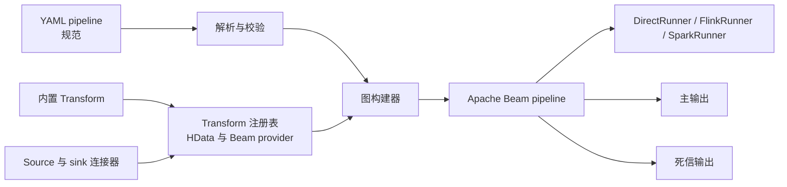

[](https://github.com/stuxuhai/HData/actions/workflows/ci.yml)
[](LICENSE)
[](https://openjdk.org/)
[](https://maven.apache.org/)

## HData

基于 [Apache Beam](https://beam.apache.org/) 的数据同步 / ETL 工具，使用 Kotlin 编写。
每个作业由一份 pipeline 文件描述，其格式对齐 [Beam YAML](https://beam.apache.org/documentation/sdks/yaml/) 规范。

> 英文文档见 [README.md](README.md)。

### 架构



[架构说明](docs/ARCHITECTURE.md) 详细描述了解析、provider、图构建和错误处理层。

### 特性

- **YAML 描述作业**：source / transform / sink 全部在一份 pipeline 文件中声明，常见同步无需编写代码。
- **兼容 Beam YAML**：结构、变量替换和 `${VAR}` 占位符遵循 Beam YAML 规范，pipeline 可以平滑迁移。
- **丰富连接器**：JDBC、Kafka、Pulsar、Hive、Redis、Neo4j、Iceberg、Debezium（CDC）、MongoDB、HBase、FTP、Filesystem、Elasticsearch 6/8、RabbitMQ、ClickHouse、Cassandra、Amazon SQS、Prometheus、DynamoDB。
- **死信（Dead Letter）**：异常记录会路由到下游错误集合而非使作业失败；每条死信保留原始行的时间戳与窗口，因而可重放。
- **多 Runner**：同一份 pipeline 可在 DirectRunner / FlinkRunner / SparkRunner 上运行。
- **聚合下推**：部分连接器可将 `sum` / `avg` / `count` 聚合原生下推至数据源。
- **DAG 构建**：支持 chain / composite、分支与合流、嵌套、拓扑排序和窗口传播。

### 支持的连接器

| 连接器 | 读取 | 写入 | 测试覆盖 |
|---|:---:|:---:|---|
| JDBC | ✅ | ✅ | 端到端（H2 内存库 + Testcontainers） |
| Kafka | ✅ | ✅ | 端到端（MockConsumer，真实 SDF）+ Testcontainers |
| Pulsar | ✅ | ✅ | 配置/序列化测试 + Testcontainers（真实 broker） |
| Hive | ✅ | ✅ | 端到端（本地目录 + 进程内 metastore）+ Testcontainers（真实 metastore Thrift 服务） |
| Redis | ✅ | ✅ | 端到端（embedded-redis + Testcontainers） |
| Iceberg | ✅ | ✅ | 端到端（本地 HadoopCatalog）+ Testcontainers（S3 兼容 warehouse） |
| Debezium | ✅（CDC） | — | 端到端（嵌入式引擎）+ Testcontainers（真实 MySQL binlog） |
| FTP | ✅ | ✅ | 端到端（进程内 FtpServer） |
| Filesystem | ✅ | ✅ | 端到端（本地临时目录）+ Testcontainers（MinIO） |
| Neo4j | ✅ | ✅ | 逻辑层 + Testcontainers |
| MongoDB | ✅ | ✅ | 逻辑层 + Testcontainers |
| HBase | ✅ | ✅ | 逻辑层 |
| Elasticsearch 6 | ✅ | ✅ | 逻辑层 + Testcontainers |
| Elasticsearch 8 | ✅ | ✅ | 逻辑层 + Testcontainers |
| RabbitMQ | ✅ | ✅ | 配置校验 + Testcontainers（真实 broker） |
| ClickHouse | ✅ | ✅ | 配置校验 + Testcontainers（真实 server） |
| Cassandra | ✅ | ✅ | 配置校验、类型映射逻辑 + Testcontainers（真实集群） |
| Amazon SQS | ✅ | ✅ | 配置校验 + Testcontainers（真实队列） |
| Prometheus | ✅（只读） | — | 配置校验、解析器逻辑 + Testcontainers（真实 server） |
| DynamoDB | ✅ | ✅ | 配置校验、类型映射逻辑 + Testcontainers（amazon/dynamodb-local） |

所有连接器的 `Read*` / `Write*` 配置参数（类型、默认值、约束与互斥关系）见 [docs/connectors.md](docs/connectors.md)。

补充服务测试使用 `integration-tests` Maven profile 和以 `IT` 结尾的类。它们针对临时 Testcontainers 服务运行；常规 `mvn test` 仍保持自包含。

### 快速开始

```bash
mvn -q package

java -cp 'hdata-core/target/classes:hdata-jdbc/target/classes:<依赖>' \
  me.jayer.hdata.core.HData --pipeline=examples/jdbc-to-jdbc.yaml
```

常用参数：

| 参数 | 说明 |
|---|---|
| `--pipeline=<path>` | pipeline 文件（`.yaml` / `.yml`） |
| `--dryRun` | 仅构建并打印 DAG，不提交运行 |
| `--runner=DirectRunner` | 可从命令行传入任意 Beam `PipelineOptions` |
| `--waitUntilFinish=false` | 提交后不阻塞等待，适合流式作业 |
| `--runManifest=run.json` | 写入图校验和作业状态的脱敏 JSON 审计记录；其中绝不包含连接器配置 |

### 批流执行

在 pipeline 顶层声明预期执行模式。`auto` 为默认值：core 在配置的 source 存在无界输入时选择流模式，否则选择批模式。`batch` 会及早拒绝无界 source；对于必须在流 runner 下运行的有界作业也可以使用 `streaming`。

```yaml
execution:
  mode: streaming # auto | batch | streaming

pipeline:
  type: chain
  # ...
```

提交长期运行的流作业时使用 `--waitUntilFinish=false`。无界 Debezium source，或配置 `streaming: true` 的 RabbitMQ/SQS 会被自动检测。当前 Pulsar 连接器仍是有界快照；持久化 Pulsar 消费者需要具名订阅与确认策略。

无界的 `ReadFromDebezium` 作业要求 `offset_file`（MySQL 还需要 `schema_history_file`）指向持久化存储——否则重启或调度到其他 worker 会丢失 CDC 位点，导致变更被重复或丢失。仅在开发环境下可设置 `allow_ephemeral_state: true` 显式接受这一风险。详见 [docs/connectors.md](docs/connectors.md#debezium)。

默认只有 DirectRunner 在 classpath 上：

| profile | runner 依赖 | 说明 |
|---|---|---|
| 无 | `beam-runners-direct-java` | 默认，`--runner=DirectRunner` |
| `-Pflink-runner` | `beam-runners-flink-2.2` | `--runner=FlinkRunner` |
| `-Pspark-runner` | `beam-runners-spark-4` | `--runner=SparkRunner`；Spark 本身由 spark-submit 提供 |
| `-Pspark-local` | Spark 4 本体 | 叠加 `-Pspark-runner`；仅本地通过 `java -cp` 运行时需要 |

> 根 pom 将 Spark 传递引入的 Hadoop 升级至 **3.5.0**。Spark 4.0.2 自带的 Hadoop 3.4.1 在
> `UserGroupInformation` 中仍调用 `Subject.getSubject(...)`；Hadoop 3.5.0 则使用 `Subject.current()`。
> 降级 Hadoop 会破坏 Spark runner。

可部署 classpath 的打包、向真实 Flink/Spark 集群提交、密钥注入、日志和指标见 [docs/DEPLOYMENT.md](docs/DEPLOYMENT.md)。

### 从源码构建

要求：

- **JDK 17**（目标字节码 Java 17）
- **Maven 3.9+**（项目不提供 wrapper）

```bash
# 首次构建需联网从 Maven Central 拉取依赖
mvn -q package

# 运行完整测试套件（约 1900 项，不需要外部服务）
mvn -q test
```

程序入口为 `me.jayer.hdata.core.HData`；运行方式见上方「快速开始」。

### pipeline 文件

线性作业使用 `chain`，输入由前一个节点隐式提供：

```yaml
pipeline:
  type: chain
  source:
    type: ReadFromJdbc
    config:
      url: "jdbc:mysql://127.0.0.1:3306/demo?useSSL=false"
      user: root
      password: "${MYSQL_PASSWORD}"
      tables: ["t_order"]
      partition_column: id
      partition_num: 8
  transforms:
    - type: MapToFields
      config:
        fields:
          order_id: id
          amount: total_amount
  sink:
    type: WriteToJdbc
    config:
      url: "jdbc:mysql://127.0.0.1:3306/dw?useSSL=false"
      user: root
      password: "${MYSQL_PASSWORD}"
      table: dws_order

options:
  runner: DirectRunner
```

分支或合流使用 `composite`（省略 `type` 时的默认值）；节点通过 `input` 相互引用，声明顺序不影响图构建：

```yaml
pipeline:
  transforms:
    - type: Flatten
      name: AllOrders
      input: [ReadHot, ReadArchived]
    - type: ReadFromJdbc
      name: ReadHot
      config: { ... }
    - type: ReadFromJdbc
      name: ReadArchived
      config: { ... }
```

更多示例位于 `examples/`：

- `jdbc-to-jdbc.yaml` —— 单表同步
- `dead-letter.yaml` —— 死信：坏数据进入单独表而不是令作业失败
- `branching.yaml` —— 多 source 读取、合流、分支与嵌套 chain

配置中的 `${VAR}` / `${VAR:-默认值}` 会在解析前替换，按系统属性、环境变量的顺序解析，因此密码无需写入配置文件。

### 内置 Transform

| type | 说明 |
|---|---|
| `Create` | 从字面量构造数据，自动推断 schema |
| `MapToFields` | 字段选择 / 重命名 / 删除（`append` + `drop`） |
| `AddFields` | 追加有类型的常量字段，用于分区值和血缘标签 |
| `Filter` | 保留满足 `equals`、`not_equals`、`in`、`is_null` 或 `is_not_null` 的行 |
| `Explode` | 将 ARRAY/ITERABLE 字段展开为每个元素一行 |
| `JsonToFields` | 将 JSON 字符串字段解析为显式类型列 |
| `FillNulls` | 用有类型的默认值替换空字段 |
| `Flatten` | 合并多个具有相同 schema 的输入 |
| `LogForTesting` | 打印每条记录并透传 |
| `StripErrorMetadata` | 将死信记录还原为原始记录 |
| `AssertEqual` | 断言输入等于给定集合，用于测试 pipeline 文件 |

连接器（`hdata-jdbc`）：`ReadFromJdbc` / `WriteToJdbc`。

classpath 上的 Beam 原生 `SchemaTransformProvider` 也可直接将其 URN 用作 `type`，例如 `beam:schematransform:org.apache.beam:jdbc_read:v1`。

### 死信

在 sink 的 config 中声明 `error_handling.output`，错误流将以 `<节点>.<output>` 暴露，且**必须由下游节点消费**，否则图构建会失败：

```yaml
    - type: WriteToJdbc
      name: WriteOrders
      config:
        table: dws_order
        error_handling:
          output: rejected
  extra_transforms:
    - type: StripErrorMetadata
      name: Recovered
      input: WriteOrders.rejected
```

### 连接器配置参考

所有连接器——JDBC / Kafka / Pulsar / Hive / Redis / Neo4j / Iceberg / Debezium / MongoDB / HBase / FTP /
Filesystem / Elasticsearch 6/8 / RabbitMQ / ClickHouse / Cassandra / Amazon SQS / Prometheus / DynamoDB——的
`Read*` / `Write*` 配置参数（类型、默认值、约束与互斥关系）见 [docs/connectors.md](docs/connectors.md)。

### 添加新连接器

1. 实现 `TransformProvider`（或 `TypedTransformProvider<C>`），每个 provider 返回一个 `RowSource` / `RowTransform` / `RowSink`。
2. 在 `META-INF/services/me.jayer.hdata.core.spi.TransformProvider` 中注册。
3. 将新模块添加到根 pom 的 `<modules>`，并依赖 `hdata-core`。

### 设计说明

架构、配置格式的设计取舍及与 Beam 编程指南的映射见[架构说明](docs/ARCHITECTURE.md)；Runner 证据见[支持矩阵](docs/RUNNER_SUPPORT.md)；聚合下推设计见 [docs/PUSHDOWN.md](docs/PUSHDOWN.md)。连接器依赖与 class-loader 隔离见 [docs/DEPENDENCY_ISOLATION.md](docs/DEPENDENCY_ISOLATION.md)；插件打包见 [docs/PLUGIN_API.md](docs/PLUGIN_API.md)。可部署镜像和 Flink 提交模板见 [docs/DEPLOYMENT.md](docs/DEPLOYMENT.md)。pipeline 与连接器配置兼容性见 [docs/PIPELINE_COMPATIBILITY.md](docs/PIPELINE_COMPATIBILITY.md)；有状态 Transform 要求见 [docs/STATEFUL_TRANSFORMS.md](docs/STATEFUL_TRANSFORMS.md)。当前生产就绪度评估与优先级改进计划见 [docs/MATURITY_ASSESSMENT.md](docs/MATURITY_ASSESSMENT.md)。

## 许可证

HData 基于 [Apache License 2.0](LICENSE) 发布。版权归 The HData Authors 所有，并构建于 [Apache Beam](https://beam.apache.org/)（同为 Apache 2.0）之上。

## 参与贡献

欢迎提交 Issue 和 Pull Request。开发环境、构建/测试、代码约定和新增连接器的方法见 [CONTRIBUTING.md](CONTRIBUTING.md)。社区行为准则见 [CODE_OF_CONDUCT.md](CODE_OF_CONDUCT.md)。请按 [SECURITY.md](SECURITY.md) 私下报告安全漏洞，避免公开讨论。

> 注：本仓库的 `AGENTS.md` 为 AI 编程助手提供工程约定，普通贡献者无需阅读。
